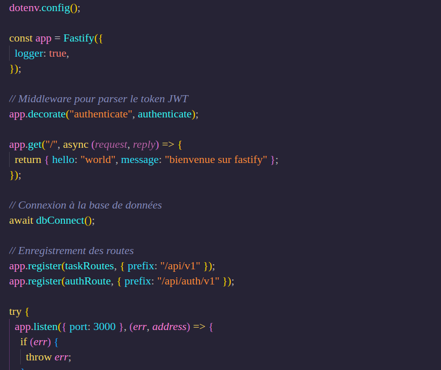

# API de Gestion de Tâches avec Fastify




Une API RESTful moderne pour la gestion de tâches, construite avec Fastify, MongoDB et JWT pour l'authentification.

## 🚀 Fonctionnalités Actuelles

- **Authentification Sécurisée**

  - Inscription et connexion utilisateur
  - JWT pour l'authentification sécurisée
  - Protection des routes avec middleware d'authentification

- **Gestion des Tâches**

  - Création, lecture, mise à jour et suppression de tâches
  - Association automatique des tâches aux utilisateurs
  - Récupération des tâches par utilisateur

- **Gestion des Utilisateurs**
  - Profil utilisateur avec tâches associées
  - Administration des utilisateurs (pour les rôles admin)

## 🔧 Configuration Requise

- Node.js 22+ et npm
- MongoDB (local ou Atlas)
- Variables d'environnement (voir `.env.example`)

## 🛠 Installation

1. Cloner le dépôt

   ```bash
   git clone [URL_DU_REPO]
   cd Fastify
   ```

2. Installer les dépendances

   ```bash
   npm install
   ```

3. Configurer les variables d'environnement

   ```bash
   cp .env.example .env
   # Puis éditer le fichier .env avec vos configurations
   ```

4. Démarrer le serveur
   ```bash
   npm run dev
   ```

## 🔌 Variables d'Environnement

Créez un fichier `.env` à la racine du projet avec les variables suivantes :

```
PORT=3000
MONGODB_URI=votre_uri_mongodb
JWT_SECRET=votre_secret_jwt
```

## 📚 Documentation des Routes

### Authentification

- `POST /api/auth/v1/register/user` - Inscription d'un nouvel utilisateur
- `POST /api/auth/v1/login/user` - Connexion utilisateur

### Tâches

- `GET /api/v1/get/tasks` - Récupérer toutes les tâches de l'utilisateur
- `GET /api/v1/get/task/:id` - Récupérer une tâche spécifique
- `POST /api/v1/add/tasks` - Créer une nouvelle tâche
- `PUT /api/v1/update/tasks/:id` - Mettre à jour une tâche
- `DELETE /api/v1/delete/task/:id` - Supprimer une tâche

## 🚀 Fonctionnalités Futures

### Notifications en Temps Réel

- Notifications push pour les échéances de tâches
- Alertes pour les tâches importantes
- Intégration avec les services de messagerie (email, SMS)

### Messagerie entre Utilisateurs

- Système de messagerie privée
- Notifications de messages non lus
- Partage de tâches entre utilisateurs

### Rappels et Échéances

- Rappels personnalisables
- Notifications d'échéance approchante
- Calendrier des tâches

### Améliorations Techniques

- Cache Redis pour de meilleures performances
- Mise en cache des requêtes fréquentes
- Système de logs avancé

## 🤝 Contribution

Les contributions sont les bienvenues ! N'hésitez pas à ouvrir une issue ou à soumettre une pull request.

1. Fork le projet
2. Créez votre branche de fonctionnalité (`git checkout -b feature/AmazingFeature`)
3. Committez vos changements (`git commit -m 'Add some AmazingFeature'`)
4. Poussez vers la branche (`git push origin feature/AmazingFeature`)
5. Ouvrez une Pull Request

## 📄 Licence

Distribué sous la licence [MIT](LICENSE). Voir `LICENSE` pour plus d'informations.

## ✨ Auteur

- [@elhalj](https://github.com/votreusername)

---

<p align="center">
  Fait avec ❤️ et Fastify
</p>
